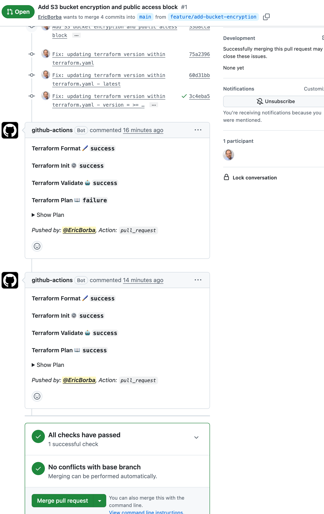

# Lab M4.10 - Terraform Git Workflows

## Workflow

1. Create feature branch
2. Make infrastructure changes
3. Push and open PR
4. GitHub Actions runs format, validate, plan
5. Review plan output in PR comment
6. Merge to main

## CI/CD Pipeline

- **Format check** — ensures consistent code style
- **Validate** — catches syntax errors
- **Plan** — shows proposed changes on PRs

## Repository Structure

```
├── .github/
│   ├── workflows/
│   │   └── terraform.yml
│   └── pull_request_template.md
├── .gitignore
├── main.tf
├── variables.tf
├── outputs.tf
└── screenshots/
    └── planOutputandPRComment.png
```

## Infrastructure

An S3 bucket provisioned with:

- **Versioning** enabled
- **Server-side encryption** (AES256)
- **Public access block** — all public access denied

## Verification

The screenshot below shows the GitHub Actions pipeline running on the pull request `feature/add-bucket-encryption → main`. Two workflow runs are visible: the first with `Terraform Plan: failure` (due to an expired OpenPGP signing key on `hashicorp/aws v5.100.0`) and the second with all checks passing after pinning the provider version to `>= 5.0, < 5.100.0`.


